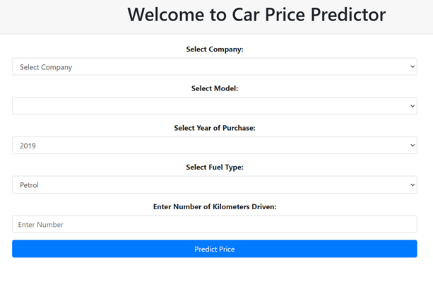
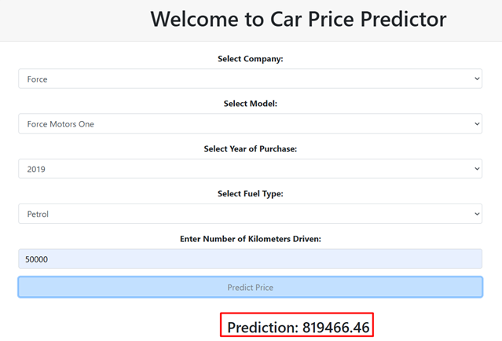

# Car Price Prediction Using Linear Regression

A machine learning-powered web application that predicts the price of used cars based on essential input features such as brand, model, year of purchase, fuel type, and kilometers driven. This project utilizes a **Linear Regression** model and provides a responsive web interface built with **Flask**.

---

## 🚗 Project Overview

In today’s automotive market, estimating the price of a used car accurately is a complex task. This project addresses the challenge by applying machine learning techniques to historical car data, allowing users to predict car prices with reliability and transparency. 

---

## 🎯 Objectives

- Develop a predictive model using Linear Regression.
- Understand key factors affecting car prices through data analysis.
- Build an intuitive web interface for public usage.
- Assist various stakeholders—buyers, sellers, and dealerships—with data-driven pricing decisions.

---

## 🛠️ Technologies Used

- **Python**  
- **Flask**  
- **Pandas, NumPy, Scikit-learn**  
- **HTML, Bootstrap**  
- **Google Colab (for training & experiments)**  
- **Joblib / Pickle (for saving/loading the model)**

---

## 💡 Features

- Dynamic dropdown for car company, model, fuel type, and year.
- Real-time prediction result displayed on the dashboard.
- Fully responsive interface with a clean, modern look.
- Model trained using cleaned car dataset for enhanced accuracy.

---

## 🚀 How to Install and Run

### Prerequisites

Make sure you have Python 3.x and Git installed.

### Step 1: Clone the Repository

```bash
git clone https://github.com/fayazur-rahman/car-price-prediction.git
cd car-price-prediction
```

### Step 2: (Optional) Create Virtual Environment

```bash
python -m venv venv
# Windows:
venv\Scripts\activate
# macOS/Linux:
source venv/bin/activate
```

### Step 3: Install Dependencies

```bash
pip install flask pandas numpy scikit-learn joblib
```

### Step 4: Launch the Application

```bash
python application.py
```

Then open your browser at `http://127.0.0.1:5000/`

---

## 📁 Project Structure

```
car-price-prediction/
│
├── application.py           # Flask app
├── LinearRegressionModel.pkl# Trained model
├── Cleaned_CarData.csv      # Dataset
├── templates/
│   └── index.html           # Web interface
├── static/
│   └── style.css            # Styling
├── README.md                # Project documentation
└── requirements.txt         # Dependencies list
```

---

## 📈 Sample Output

- Input Example: Force | Force Motors One | 2019 | Petrol | 50,000 km  
- Predicted Price: 8.19 Lakhs *(example result)*

---

## 🔍 Real-Life Use Cases

- **Marketplaces:** Automate pricing of listings.
- **Dealerships:** Improve stock turnover with accurate pricing.
- **Banks/Insurers:** Assist in valuation and risk assessment.
- **Government/Researchers:** Analyze market trends and consumer behavior.

---


## 🖼️ Project Screenshots

| Car Price Prediction Dashboard | Prediction Output |
|-------------------------------|--------------------|
|  |  |

> **Figure**: The left image shows the dashboard interface. After selecting the car features and submitting, the right image shows the predicted price result.

---

## 📧 Contact

For support or collaboration:  
**Email:** fayazur7@gmail.com  
**Developed By:** MD Fayazur Rahman

---
